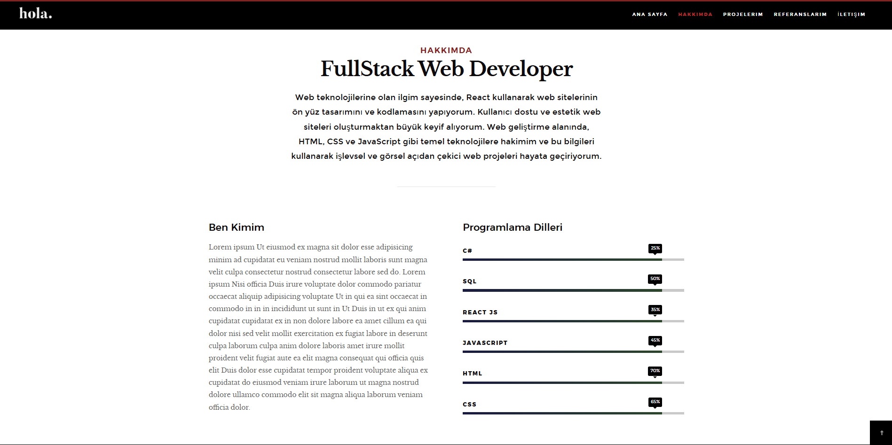
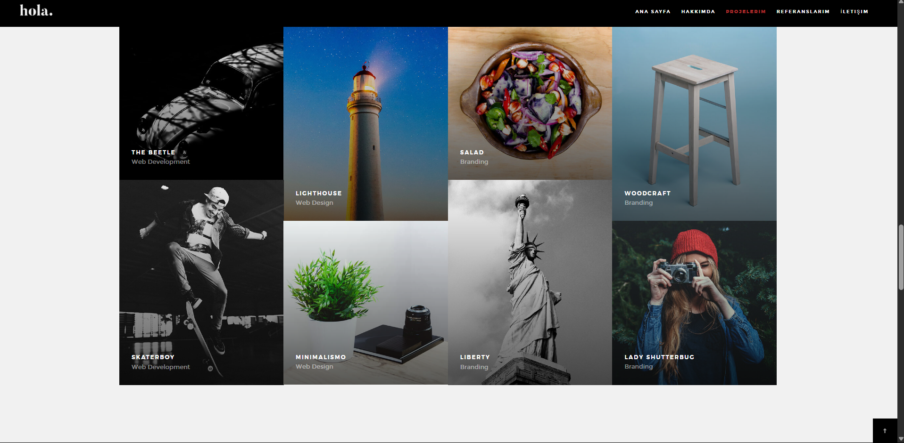
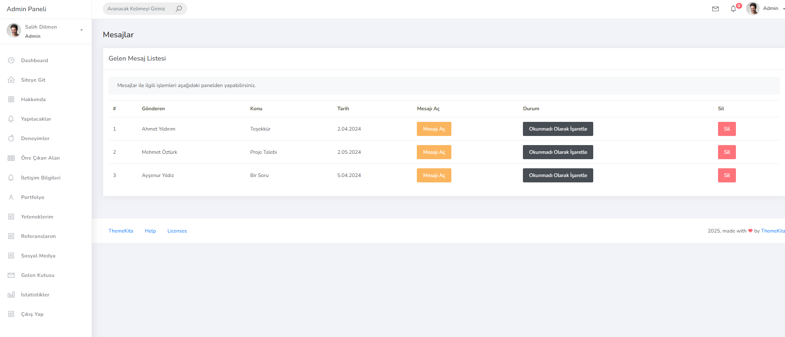
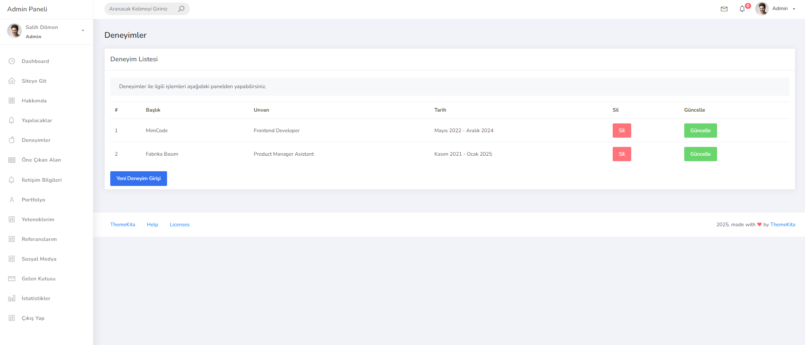
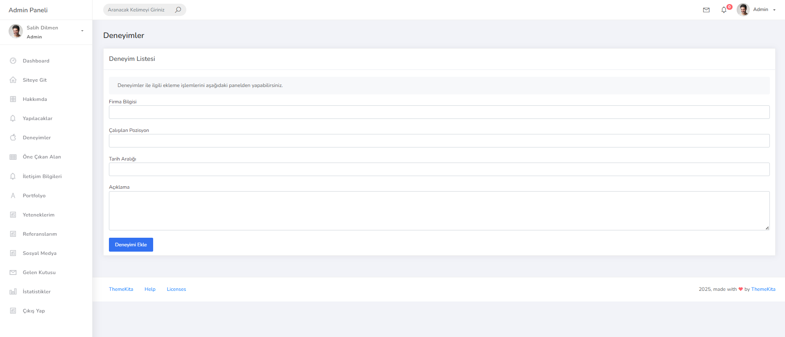

# 📌 Projeye Genel Bakış

## 🔧 Admin Paneli
- Kişisel bilgiler, projeler, referanslar ve sosyal medya hesaplarının CRUD işlemleri  
- İçeriklerin kolayca eklenip düzenlenebileceği kullanıcı dostu bir arayüz

## 💻 Kullanıcı Arayüzü
- Modern, şık ve mobil uyumlu tasarım  
- CV’nizi ve projelerinizi etkileyici şekilde sunma imkânı

---

# ⚙️ Kullanılan Teknolojiler

### 🧩 Backend
- ✅ ASP.NET Core 6.0  
- ✅ Entity Framework Core (EF Core) – Code First Yaklaşımı  
- ✅ Microsoft SQL Server  
- ✅ LINQ  

### 🎨 Frontend
- ✅ HTML5  
- ✅ CSS3  
- ✅ Bootstrap 5  
- ✅ JavaScript  

---

# 🧱 Proje Mimarisi

- **Entity Layer**: Code-First ile veritabanı tabloları  
- **Data Access Layer (DAL)**: EF Core ile veri işlemleri  
- **Presentation Layer**: Razor View Engine ile hazırlanmış kullanıcı arayüzü

---

# 🔥 Öne Çıkan Özellikler

- Admin panel üzerinden içeriklerde **CRUD işlemleri**
- Bildirim ekranı ve yapılacaklar listesi yönetimi
- `ViewComponent` yapısıyla modüler ve sürdürülebilir mimari
- Tüm cihazlara uyumlu **responsive** tasarım
- **SOLID** prensiplerine uygun, temiz ve okunabilir kod yapısı
- **DRY (Don't Repeat Yourself)** yaklaşımı ile tekrar eden kodların azaltılması

---

# 🎯 Kazanılan Yetkinlikler

- ASP.NET Core ile MVC mimarisinde proje geliştirme pratiği  
- Entity Framework ile Code-First yaklaşımı ve Migration yönetimi  
- Razor, PartialView ve ViewComponent kullanarak modüler yapı oluşturma  
- Bootstrap ile responsive ve modern UI geliştirme  
- SQL Server ile veritabanı tasarımı ve yönetimi  
- Gerçek dünya senaryosuna dayalı uçtan uca proje geliştirme deneyimi

- ## 📸 Projeden Ekran Görüntüleri

